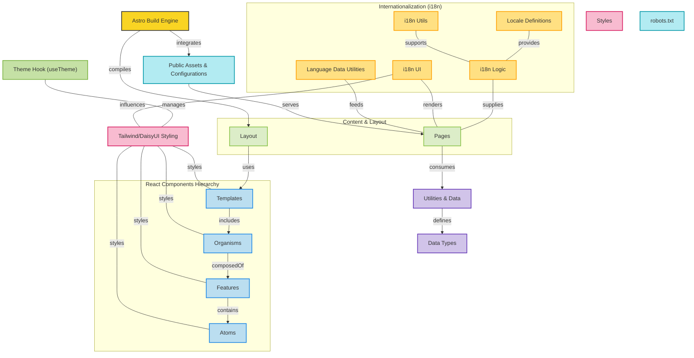
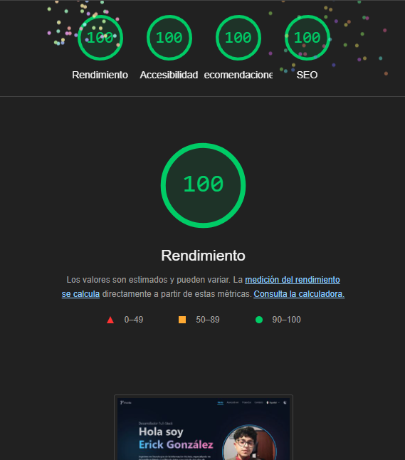

# 🚀 Portafolio Personal

Se realizó el portafolio con la tecnología de [Astro](https://astro.build/) y con la librería de [React](https://es.react.dev/) montada a Astro, con [Tailwind](https://tailwindui.com/) en su interfaz desde @tailwindcss/vite con Tailwind CSS 4.1.3.

- Se montó [DaisyUI](https://daisyui.com/) sobre Tailwind para manejar los temas de la aplicación (v5.0.6).
- Versión estable `v.3.1.3` release, próximas y futuras actualizaciones.
- Próxima actualización `v.3.1.4` o `v.3.1.x` o `v.3.x.x`.
- Se utiliza la herramienta de reenvío de puertos desde host de túnel para revisar los cambios del servidor en tiempo real desde un celular.

# 🔷 Diagrama de flujo de procesos para entender el portfolio



## 🏯 Lighthouse y optimización de la página



## 📋 Tabla de Contenidos

- [🛠️ Tecnologías Utilizadas](#️-tecnologías-utilizadas)
- [📁 Estructura del Proyecto](#-estructura-del-proyecto)
- [⚙️ Requisitos Previos](#️-requisitos-previos)
- [🔧 Instalación](#-instalación)
- [💻 Desarrollo Local](#-desarrollo-local)
- [🗄️ Base de Datos](#️-base-de-datos)
- [🌐 Internacionalización](#-internacionalización)
- [🎨 Temas](#-temas)
- [📄 Licencia](#-licencia)
- [🤝 Contribuir](#-contribuir)
- [📞 Contacto](#-contacto)

## 🛠️ Tecnologías Utilizadas

- **Framework**: [Astro](https://astro.build/) v5.4.2
- **UI Framework**: [React](https://reactjs.org/) v18.3.1
- **Estilos**:
  - [Tailwind CSS](https://tailwindcss.com/) v4.1.3
  - [DaisyUI](https://daisyui.com/) v5.0.6
- **Animaciones**:
  - [Framer Motion](https://www.framer.com/motion/)
  - [Swiper](https://swiperjs.com/)
  - [Animate.css](https://animate.style/)
- **Formularios**:
  - [React Hook Form](https://react-hook-form.com/)
  - [Zod](https://zod.dev/)
- **Otros**:
  - [TypeScript](https://www.typescriptlang.org/)
  - [Lucide Icons](https://lucide.dev/)
  - [React Icons](https://react-icons.github.io/react-icons/)

## 📁 Estructura del Proyecto

```bash
src/
├── components/           # Componentes React organizados por Atomic Design
│   ├── atoms/           # Componentes básicos
│   ├── features/        # Características específicas
│   ├── organisms/       # Componentes compuestos
│   └── templates/       # Plantillas Astro
├── db/                  # Configuración de la base de datos
├── hooks/               # Hooks personalizados de React
├── i18n/                # Configuración de internacionalización
├── layouts/             # Layouts de Astro
├── pages/               # Rutas y páginas (es, en, fr)
├── schemas/             # Esquemas de validación Zod
├── styles/              # Estilos globales
├── types/               # Tipos TypeScript
└── utils/               # Utilidades y datos estáticos
```

## ⚙️ Requisitos Previos

- Node.js (v18 o superior)
- pnpm
- Git

## 🔧 Instalación

- Clona el repositorio:

```bash
    git clone https://github.com/muke78/Portafolio.git
    cd Portafolio
```

- Instala las dependencias:

```bash
    pnpm install
```

- Copia el archivo de variables de entorno:

```bash
    cp .env.example .env
```

## 💻 Desarrollo Local

- Inicia el servidor de desarrollo:

```bash
    pnpm dev
```

- El sitio estará disponible en [http://localhost:4321](http://localhost:4321)

## 🗄️ Base de Datos

- Configuración de Drizzle
- Genera las migraciones:

```bash
    pnpm db:generate
```

- Aplica las migraciones:

```bash
    pnpm db:migrate
```

- Visualiza la base de datos (opcional):

```bash
    pnpm db:studio
```

## 🌐 Internacionalización

El proyecto soporta múltiples idiomas:

- 🇪🇸 Español (es)
- 🇺🇸 Inglés (en)
- 🇫🇷 Francés (fr)

Los archivos de traducción se encuentran en `locales`.

## 🎨 Temas

El proyecto incluye un sistema de temas usando DaisyUI con soporte para modo claro y oscuro.

## 📄 Licencia

Este proyecto está bajo la licencia MIT. Ver el archivo LICENSE para más detalles.

## 🤝 Contribuir

Las contribuciones son bienvenidas. Por favor, abre un issue o pull request para sugerir cambios o mejoras.

## 📞 Contacto

Si tienes alguna pregunta o sugerencia, no dudes en contactarme:

- Nombre: [Erick Gonzalez](https://github.com/muke78)
- Correo : <erickm.gonzalez.rivera@gmail.com>

⭐️ Si te gusta este proyecto, ¡no olvides darle una estrella en GitHub!
