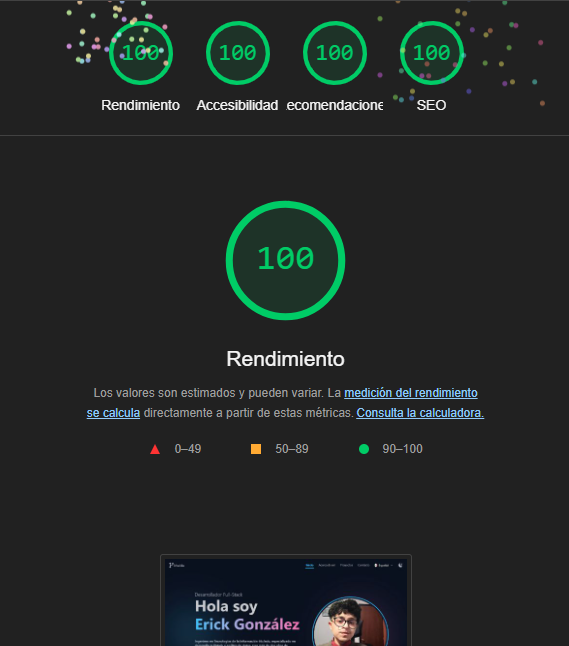

# 🚀 Portafolio Personal

Portafolio construido con [Astro](https://astro.build/) (SSR, `output: "server"`) e islas de [React](https://react.dev/) para las partes interactivas, con [Tailwind CSS v4](https://tailwindcss.com/) (CSS-first, vía `@tailwindcss/vite`) y componentes [shadcn/ui](https://ui.shadcn.com/) sobre [Base UI](https://base-ui.com/). Desplegado en [Vercel](https://vercel.com/).

Contenido (proyectos, experiencia, comentarios) servido desde un backend propio externo, consumido a través de un proxy interno en `/api/*` que agrega el token de autenticación server-side.

## 🏯 Lighthouse y optimización de la página



## 📋 Tabla de Contenidos

- [🛠️ Tecnologías Utilizadas](#️-tecnologías-utilizadas)
- [📁 Estructura del Proyecto](#-estructura-del-proyecto)
- [⚙️ Requisitos Previos](#️-requisitos-previos)
- [🔧 Instalación](#-instalación)
- [💻 Desarrollo Local](#-desarrollo-local)
- [🌐 Internacionalización](#-internacionalización)
- [🎨 Temas](#-temas)
- [🔐 Panel de administración](#-panel-de-administración)
- [📄 Licencia](#-licencia)
- [🤝 Contribuir](#-contribuir)
- [📞 Contacto](#-contacto)

## 🛠️ Tecnologías Utilizadas

- **Framework**: [Astro](https://astro.build/) v7 (SSR, adaptador [`@astrojs/vercel`](https://docs.astro.build/en/guides/integrations-guide/vercel/))
- **UI**: [React](https://react.dev/) v18 (islas vía `@astrojs/react`)
- **Estilos**: [Tailwind CSS v4](https://tailwindcss.com/) + [shadcn/ui](https://ui.shadcn.com/) sobre [Base UI](https://base-ui.com/)
- **3D**: [Three.js](https://threejs.org/) (fondo animado, montado como isla `client:idle`)
- **Formularios**: [React Hook Form](https://react-hook-form.com/) + [Zod](https://zod.dev/)
- **Otros**: [TypeScript](https://www.typescriptlang.org/), [Lucide Icons](https://lucide.dev/), [react-country-flag](https://www.npmjs.com/package/react-country-flag), [Swiper](https://swiperjs.com/)
- **Calidad**: [Biome](https://biomejs.dev/) (lint/format) + [Husky](https://typicode.github.io/husky/) (git hooks)

## 📁 Estructura del Proyecto

```bash
src/
├── components/           # Componentes compartidos (secciones, ui/ = primitives shadcn, three/ = fondo 3D)
├── features/             # Lógica por dominio (aboutMe, projects, opinions, contact, navbar, admin)
├── i18n/                 # Traducciones (locales/*.json) y locales.ts (fuente única de verdad de idiomas)
├── layouts/               # Layouts de Astro (Layout.astro: <head>, meta, JSON-LD)
├── lib/                  # Utilidades server-side (sesión admin, rate limit, cliente del backend)
├── middleware.ts         # Validación de locale + guard del panel admin
├── pages/                # Rutas: /[lang]/home, /admin/*, /api/*
├── schemas/               # Esquemas de validación Zod
├── styles/               # Estilos globales (Tailwind v4 + tokens del tema)
└── types/                # Tipos TypeScript compartidos
```

## ⚙️ Requisitos Previos

- Node.js >= 22.12.0
- pnpm
- Git

## 🔧 Instalación

- Clona el repositorio:

```bash
    git clone https://github.com/muke78/Portafolio.git
    cd Portafolio
```

- Instala las dependencias:

```bash
    pnpm install
```

- Copia el archivo de variables de entorno y complétalo (ver `astro.config.mjs` → `env.schema` para la lista completa y su documentación):

```bash
    cp .env.example .env
```

## 💻 Desarrollo Local

- Inicia el servidor de desarrollo:

```bash
    pnpm dev
```

- El sitio estará disponible en [http://localhost:4321](http://localhost:4321)

## 🌐 Internacionalización

El proyecto soporta múltiples idiomas, definidos en `src/i18n/locales.ts` (única fuente de verdad, usada tanto por el enrutamiento de Astro como por el selector de idioma):

- 🇪🇸 Español (es) — por defecto
- 🇺🇸 Inglés (en)
- 🇫🇷 Francés (fr)

Las traducciones viven en `src/i18n/locales/{es,en,fr}.json`. El enrutamiento de idioma es `manual` (no automático) — la validación de un segmento de idioma desconocido en `/[lang]/*` ocurre en `src/middleware.ts`, que también protege `/admin/*`.

## 🎨 Temas

Claro/oscuro vía la clase `.dark` en `<html>` (Tailwind v4 `@custom-variant dark`), con persistencia en `localStorage` y detección de `prefers-color-scheme` como valor por defecto.

## 🔐 Panel de administración

`/admin/login` protege `/admin` y `/api/admin/*` con una cookie de sesión firmada (HMAC, `src/lib/adminSession.ts`):

- Sesión de vida corta (2h), comparación de contraseña en tiempo constante, y una lista de revocación en memoria (logout invalida el token del lado del servidor, no solo borra la cookie).
- Rate limiting en memoria sobre `/api/admin/login` (5 intentos / 5 min por IP).
- Ambas listas en memoria no sobreviven un cold start en serverless — es una mitigación de mejor esfuerzo adecuada para un panel de un solo administrador, no una garantía dura.

## 📄 Licencia

Este proyecto está bajo la licencia MIT. Ver el archivo LICENSE para más detalles.

## 🤝 Contribuir

Las contribuciones son bienvenidas. Por favor, abre un issue o pull request para sugerir cambios o mejoras.

## 📞 Contacto

Si tienes alguna pregunta o sugerencia, no dudes en contactarme:

- Nombre: [Erick Gonzalez](https://github.com/muke78)
- Correo : <erickm.gonzalez.rivera@gmail.com>

⭐️ Si te gusta este proyecto, ¡no olvides darle una estrella en GitHub!
